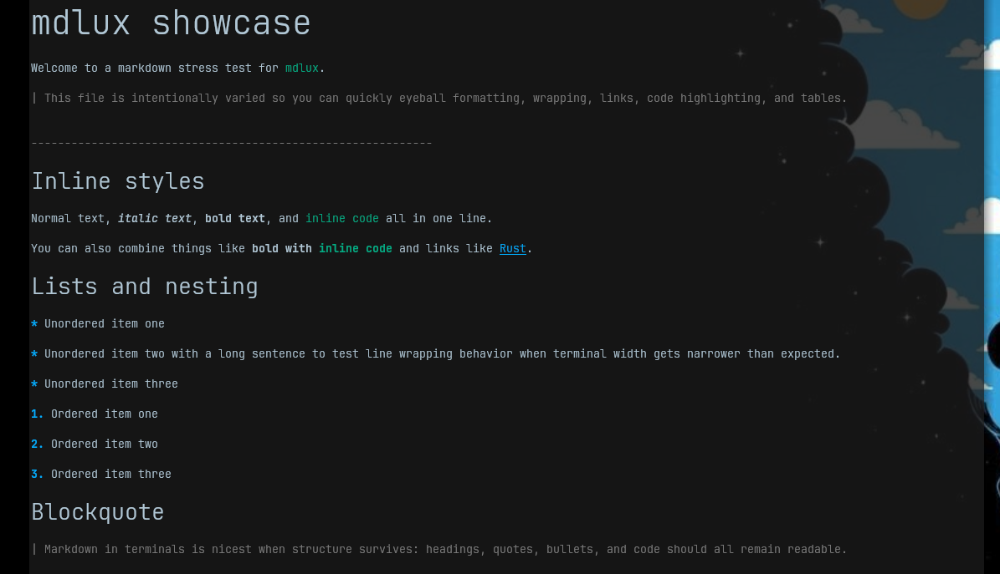
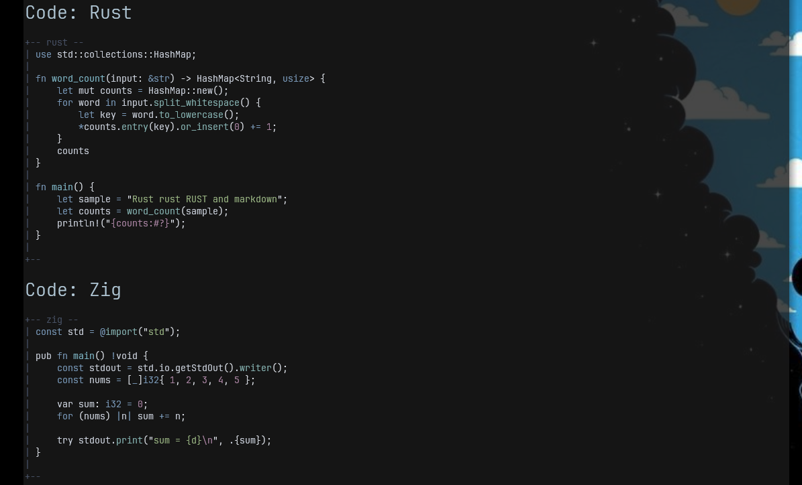
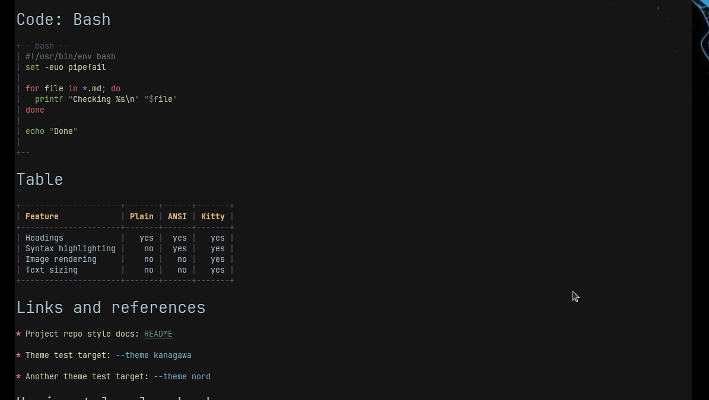

# mdlux

Terminal Markdown renderer which I made for myself because I didn't find others adequate.	ᕕ(⌐■_■)ᕗ ♪♬

Some basic features:
- plain text (just convert it to simple text without styling, quite useful sometimes)
- ANSI styling (for anything other than kitty)
- Kitty enhancements (text sizing and images)
- Somes theme (not customizable atm)

What it doesn't support atm:
- html parsing and display (might add  support later)
- inline image display
- callouts (i do plan to support this)
- tons of other things which I don't use a lot

## Usage

```bash
mdlux README.md
cat README.md | mdlux
# Override width as mdlux tries to fit widh by default
mdlux --theme nord --width 100 doc.md
# Turn off text re-sizing
mdlux --text-size false --images auto README.md
```

## Flags

```text
--width <cols>                                   // if you want to enforce
--theme <ansi|dark|light|nord|gruvbox|kanagawa>  // I like nord/kanagawa a lot
--text-size <auto|always|never>                  // resize text (basically kitty)
--images <auto|always|never>                     // render out images if supportd
--no-highlight
--plain
--list-themes
```

### Basic styling
> Theme: **ANSI**

```md
# mdlux showcase

Welcome to a markdown stress test for `mdlux`.

> This file is intentionally varied so you can quickly eyeball formatting, wrapping, links, code highlighting, and tables.

---

## Inline styles

Normal text, *italic text*, **bold text**, and `inline code` all in one line.

You can also combine things like **bold with `inline code`** and links like [Rust](https://www.rust-lang.org/).

## Lists and nesting

- Unordered item one
- Unordered item two with a long sentence to test line wrapping behavior when terminal width gets narrower than expected.
- Unordered item three

1. Ordered item one
2. Ordered item two
3. Ordered item three

## Blockquote

> Markdown in terminals is nicest when structure survives: headings, quotes, bullets, and code should all remain readable.

```



### Code

> Theme: Nord

````md
## Code: Rust

```rust
use std::collections::HashMap;

fn word_count(input: &str) -> HashMap<String, usize> {
    let mut counts = HashMap::new();
    for word in input.split_whitespace() {
        let key = word.to_lowercase();
        *counts.entry(key).or_insert(0) += 1;
    }
    counts
}

fn main() {
    let sample = "Rust rust RUST and markdown";
    let counts = word_count(sample);
    println!("{counts:#?}");
}
```

## Code: Zig

```zig
const std = @import("std");

pub fn main() !void {
    const stdout = std.io.getStdOut().writer();
    const nums = [_]i32{ 1, 2, 3, 4, 5 };

    var sum: i32 = 0;
    for (nums) |n| sum += n;

    try stdout.print("sum = {d}\n", .{sum});
}
```
````



**Bonus**:

> Theme: Kanagawa
````md
## Code: Bash

```bash
#!/usr/bin/env bash
set -euo pipefail

for file in *.md; do
  printf "Checking %s\n" "$file"
done

echo "Done"
```

## Table

| Feature | Plain | ANSI | Kitty |
|---|---:|---:|---:|
| Headings | yes | yes | yes |
| Syntax highlighting | no | yes | yes |
| Image rendering | no | no | yes |
| Text sizing | no | no | yes |

## Links and references

- Project repo style docs: [README](./README.md)
- Theme test target: `--theme kanagawa`
- Another theme test target: `--theme nord`

````



